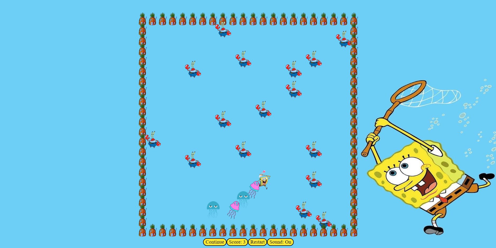

# Jellyfish Hunting!

*Jellyfish Hunting* is a Snake-Game re-creation with a Spongebob theme! Wild jellyfish spawn randomly one at a time on the map. Spongebob follows the mouse icon when infront of him to catch each jellyfish. Once caught, each jellyfish follows Spongebob. When the player reaches a certain score, Mr. Krabs will wildly spawn to stop Spongebob's joy-hunting. The game ends when Spongebob runs into a wall, his jellyfish tail, or Mr.Krabs.

You can pause the game to listen to one of Spongebob's songs.

## [Play the game here](https://spongebob-snake-game.netlify.app)

## Technologies used ⚙️

- CSS
- JavaScript
- HTML
- git

## Credits 🙌

- Check out [Animate.style](https://animate.style/).

## Recent Changes 🧹

- Added sound effects and animations when hovering while the game is paused.
- Created an animation to make the board drop off the screen when the game ends.
- Added an on/off button for sound.

## Ice Box 🧊

- [x] Make Spongebob move in eight directions
- [x] Make different jellyfish followers
- [x] Create ending animation
- [x] Bonce the character on hover when the game is paused
- [ ] Allow the player to change the game speed
- [ ] Allow the player to choose their character and theme
- [ ] Implement a high score list
- [x] Add sound and music
- [x] Add pause and continue functionality